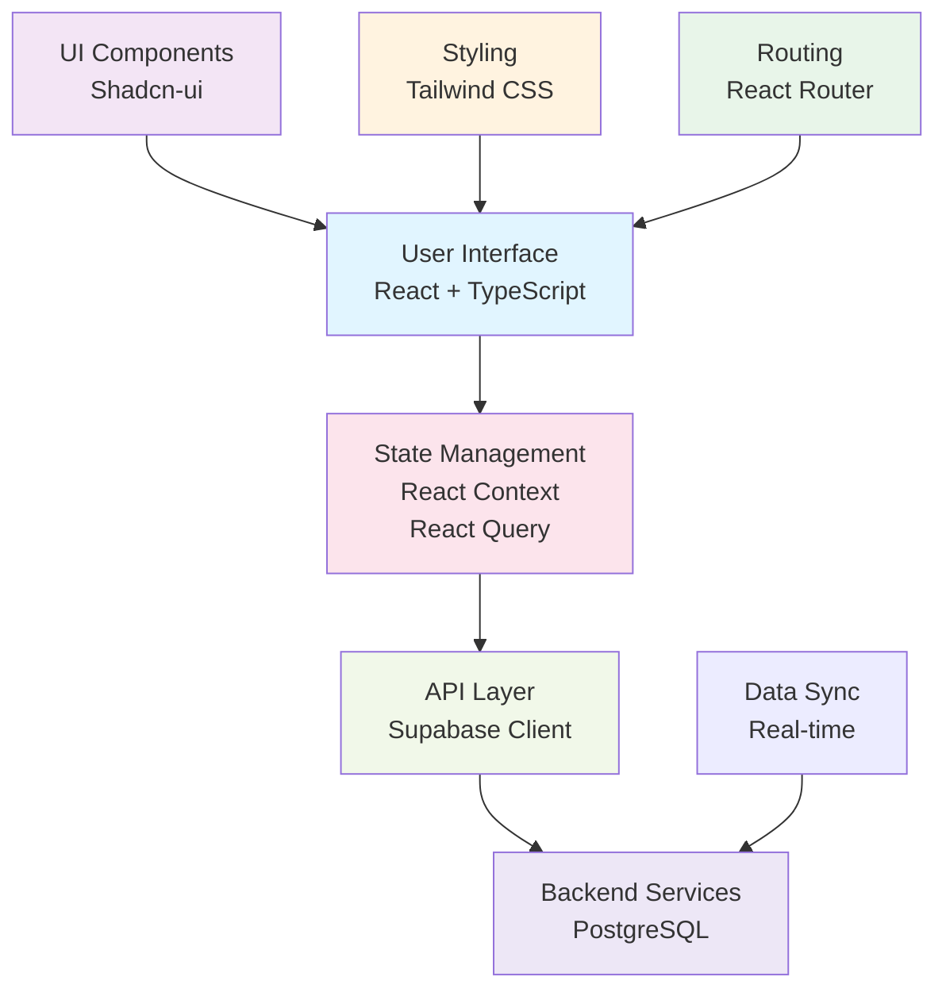
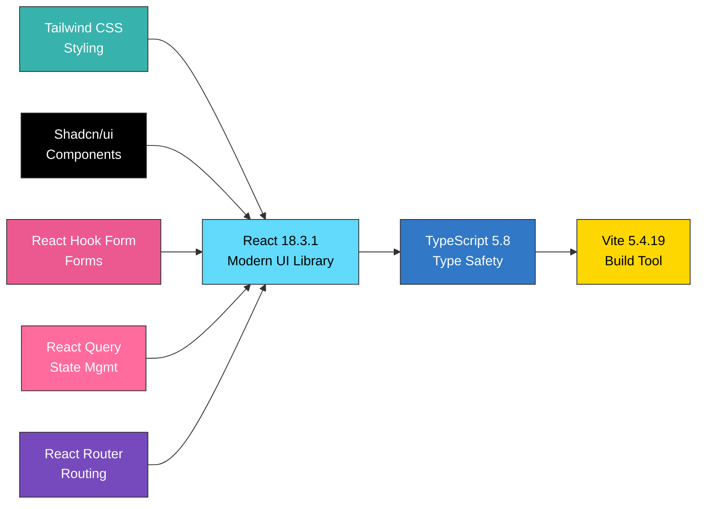

# LifeOS Central

<div align="center">
  <strong>A comprehensive daily-use personal operating system application</strong>
  <br>
  <em>Manage tasks, track habits, and organize your digital life in one unified platform.</em>
  <br><br>
  
  
  
  
  
</div>

---

## 🎯 Quick Overview

**LifeOS Central** is a full-featured personal productivity and life management application designed to help you organize, track, and optimize your daily activities. Whether you're managing tasks, building habits, or analyzing your productivity patterns, LifeOS provides an intuitive and powerful interface.

### 📊 System Architecture



### Use Cases

- **Daily task and project management** - Organize work with priorities
- **Habit tracking and goal setting** - Build better habits with streaks
- **Workflow automation through AI agents** - Automate repetitive tasks
- **Data visualization and analytics** - Track productivity patterns
- **Personal knowledge management** - Centralize your information

---

## ✨ Core Features

| Feature | Details |
|---------|----------|
| **Task Management** | Create, organize, and track tasks with priority levels and due dates |
| **Habit Tracking** | Build and monitor daily habits with streak counters |
| **Dashboard Analytics** | Visual insights into your productivity and progress |
| **Responsive Design** | Beautiful, modern UI that works on all devices |
| **Real-time Data Sync** | Instant synchronization with Supabase backend |
| **Dark Mode Support** | Full dark/light theme support with theme persistence |
| **Advanced Components** | Rich set of UI components (accordions, dropdowns, dialogs, etc.) |
| **Form Handling** | Robust form validation using React Hook Form and Zod |
| **API Integration** | Seamless integration with Supabase for data management |

---

## 📄 Table of Contents

- [Quick Overview](#quick-overview)
- [System Architecture](#system-architecture)
- [Core Features](#core-features)
- [Tech Stack](#tech-stack)
- [Getting Started](#getting-started)
- [Project Structure](#project-structure)
- [Available Scripts](#available-scripts)
- [Key Components](#key-components)
- [Database Setup](#database-setup)
- [Contributing](#contributing)
- [License](#license)
- [Support](#support)

---

## 📚 Tech Stack

### Frontend Technologies



| Category | Technology | Version |
|----------|------------|----------|
| **Framework** | React | 18.3.1 |
| **Language** | TypeScript | 5.8 |
| **Build** | Vite | 5.4.19 |
| **Styling** | Tailwind CSS | 3.4.17 |
| **Components** | Shadcn-ui, Radix UI | Latest |
| **Form Handling** | React Hook Form | 7.61.1 |
| **State Management** | React Query | 5.83.0 |
| **Routing** | React Router DOM | 6.30.1 |
| **Validation** | Zod | 3.25.76 |
| **Backend** | Supabase | 2.89.0 |
| **Database** | PostgreSQL | Latest |
| **Icons** | Lucide React | Latest |
| **Charts** | Recharts | 2.15.4 |

---

## 🚀 Getting Started

### Prerequisites

- Node.js 16+ or Bun
- npm, yarn, or Bun package manager
- Git

### Installation Steps

#### 1. Clone Repository

```bash
git clone https://github.com/HarshChoudhary2003/LifeOS_App_Daily_use_App.git
cd LifeOS_App_Daily_use_App
```

#### 2. Install Dependencies

```bash
npm install
# or
bun install
```

#### 3. Set Up Environment Variables

Create a `.env` file in the root directory:

```env
VITE_SUPABASE_URL=your_supabase_url
VITE_SUPABASE_ANON_KEY=your_supabase_anon_key
```

#### 4. Set Up Supabase (Optional)

```bash
cd supabase
# Run migrations to set up database schema
```

#### 5. Start Development Server

```bash
npm run dev
```

The app will be available at `http://localhost:5173`

---

## 📚 Available Scripts

| Command | Description |
|---------|-------------|
| `npm run dev` | Start development server with HMR |
| `npm run build` | Build for production |
| `npm run build:dev` | Build with source maps |
| `npm run preview` | Preview production build locally |
| `npm run lint` | Run ESLint code quality checks |

---

## 📄 Project Structure

```
LifeOS_App_Daily_use_App/
├── src/
│   ├── components/          # Reusable UI components
│   │   ├── ui/             # Base UI components
│   │   ├── forms/          # Form components
│   │   └── layouts/        # Layout components
│   ├── pages/              # Page-level components
│   │   ├── Dashboard.tsx
│   │   ├── Tasks.tsx
│   │   ├── Habits.tsx
│   │   └── Settings.tsx
│   ├── contexts/           # React context providers
│   ├── hooks/              # Custom React hooks
│   ├── integrations/       # Third-party integrations
│   │   └── supabase/      # Supabase client setup
│   ├── lib/                # Utility functions
│   ├── App.tsx            # Main application component
│   ├── main.tsx           # Entry point
│   └── index.css          # Global styles
├── public/                # Static assets
├── supabase/              # Database migrations
├── .env                   # Environment variables
├── package.json           # Project dependencies
├── tsconfig.json          # TypeScript config
├── vite.config.ts         # Vite config
├── tailwind.config.ts     # Tailwind config
└── README.md             # This file
```

---

## 🗍️ Key Components

### Core Application
- **App.tsx** - Main application wrapper with routing
- **Layout** - Responsive layout with sidebar & header
- **Navigation** - Main navigation menu

### Feature Modules
- **TaskManager** - Task creation, listing, and management
- **HabitTracker** - Daily habit tracking interface
- **Dashboard** - Analytics and overview
- **Settings** - User preferences and configuration

### Utilities & Helpers
- **Custom Hooks** - Data fetching, storage, theme switching
- **API Helpers** - Supabase client utilities
- **Date Utilities** - Date formatting and manipulation

---

## 🖱️ Database Setup

### Supabase Configuration

1. Create a project at [supabase.com](https://supabase.com/)
2. Copy your project URL and API key
3. Add to `.env` file
4. Run migrations from `supabase/` directory

### Database Schema

The application uses the following main tables:

```sql
-- Users table
CREATE TABLE users (
  id UUID PRIMARY KEY,
  email VARCHAR UNIQUE,
  created_at TIMESTAMP DEFAULT CURRENT_TIMESTAMP
);

-- Tasks table
CREATE TABLE tasks (
  id UUID PRIMARY KEY,
  user_id UUID REFERENCES users(id),
  title VARCHAR,
  description TEXT,
  priority INT,
  due_date DATE,
  status VARCHAR,
  created_at TIMESTAMP DEFAULT CURRENT_TIMESTAMP
);

-- Habits table
CREATE TABLE habits (
  id UUID PRIMARY KEY,
  user_id UUID REFERENCES users(id),
  name VARCHAR,
  frequency VARCHAR,
  streak INT DEFAULT 0,
  created_at TIMESTAMP DEFAULT CURRENT_TIMESTAMP
);

-- Activity logs table
CREATE TABLE activity_logs (
  id UUID PRIMARY KEY,
  user_id UUID REFERENCES users(id),
  action VARCHAR,
  created_at TIMESTAMP DEFAULT CURRENT_TIMESTAMP
);
```

---

## 🤝 Contributing

Contributions are welcome! Please follow these steps:

1. **Fork** the repository
2. **Create** a feature branch: `git checkout -b feature/amazing-feature`
3. **Make** your changes
4. **Commit**: `git commit -m 'Add amazing feature'`
5. **Push**: `git push origin feature/amazing-feature`
6. **Open** a Pull Request

### Development Guidelines

- Use **TypeScript** for type safety
- Follow **ESLint** configuration
- Write **descriptive commit** messages
- **Test** changes locally
- **Update** documentation

---

## 📄 License

MIT License - see LICENSE file for details

---

## 👨‍💻 Author

**Harsh Choudhary**

- GitHub: [@HarshChoudhary2003](https://github.com/HarshChoudhary2003)
- Email: [hc504360@gmail.com](mailto:hc504360@gmail.com)

---

## 🙏 Acknowledgments

- [Shadcn-ui](https://ui.shadcn.com/) - Beautiful component library
- [Radix UI](https://www.radix-ui.com/) - Accessible components
- [Tailwind CSS](https://tailwindcss.com/) - Utility-first CSS
- [Supabase](https://supabase.com/) - Backend infrastructure
- [Vite](https://vitejs.dev/) - Incredible build tool

---

## 📞 Support

For issues and questions:
- Open an issue on [GitHub Issues](https://github.com/HarshChoudhary2003/LifeOS_App_Daily_use_App/issues)
- Contact the maintainer

**Made by Harsh Choudhary 🚀**
